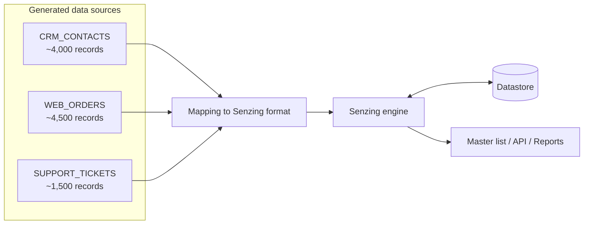
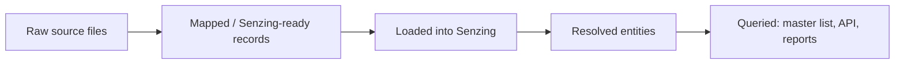

# Data Architecture and Data Flow

> 🤖 Bootcamp-generated business case: Customer 360 (synthetic data)

## Data architecture

```mermaid
flowchart LR
    subgraph Sources["Generated data sources"]
        CRM["CRM_CONTACTS<br/>~4,000 records"]
        WEB["WEB_ORDERS<br/>~4,500 records"]
        SUP["SUPPORT_TICKETS<br/>~1,500 records"]
    end
    MAP["Mapping to Senzing format"]
    ENG["Senzing engine"]
    DB[("Datastore")]
    OUT["Master list / API / Reports"]

    CRM --> MAP
    WEB --> MAP
    SUP --> MAP
    MAP --> ENG
    ENG <--> DB
    ENG --> OUT
```

## Data flow

```mermaid
flowchart LR
    RAW["Raw source files"] --> MAPPED["Mapped / Senzing-ready records"]
    MAPPED --> LOADED["Loaded into Senzing"]
    LOADED --> RESOLVED["Resolved entities"]
    RESOLVED --> QUERIED["Queried: master list, API, reports"]
```
