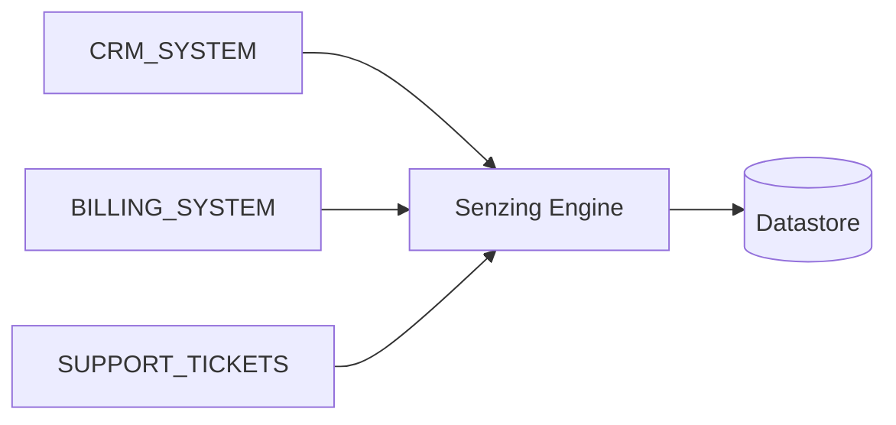
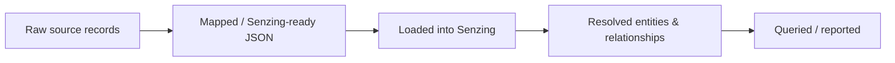

# Data Architecture & Data Flow

Diagrams for the generated Customer 360 scenario (synthetic data).

## Data Architecture

```mermaid
flowchart LR
    CRM[CRM_SYSTEM]
    BILLING[BILLING_SYSTEM]
    SUPPORT[SUPPORT_TICKETS]
    ENGINE[Senzing Engine]
    STORE[(Datastore)]

    CRM --> ENGINE
    BILLING --> ENGINE
    SUPPORT --> ENGINE
    ENGINE --> STORE
```

## Data Flow

```mermaid
flowchart LR
    RAW[Raw source records] --> MAPPED[Mapped / Senzing-ready JSON]
    MAPPED --> LOADED[Loaded into Senzing]
    LOADED --> RESOLVED[Resolved entities & relationships]
    RESOLVED --> QUERIED[Queried / reported]
```
